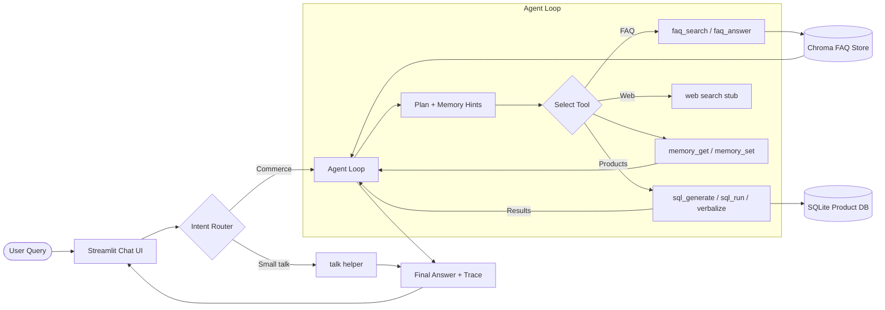

# E-commerce Chatbot (Agentic Runtime)

An agentic assistant for e-commerce stores. The bot understands customer goals, answers policy questions, and performs live product lookups against your catalog with a plan/act/observe/reflect loop. It runs on Streamlit, Groq-hosted LLMs, ChromaDB for FAQs, and SQLite for product data.

---

## Key Features
- **Agentic tool loop** – The agent plans the task, calls one tool per step, retries intelligently, and returns responses with a trace of the tools used.
- **FAQ retrieval (RAG)** – Top-k answers are pulled from a ChromaDB collection and the LLM responds strictly from that context.
- **SQL product discovery** – Natural language is converted into whitelisted `SELECT` queries, executed against SQLite, and verbalized into user-friendly product lists.
- **Session memory** – Preferred brands and budget ceilings are remembered per session via Streamlit state.
- **Small-talk fallback** – Casual chit-chat still works through the existing Groq-backed small-talk handler.
- **Guardrails & logging** – SQL statements are validated, `LIMIT` clauses are enforced automatically, and debug logging is in place for troubleshooting.

---

## Architecture Overview

1. **User query** enters through the Streamlit chat UI.
2. **Router** identifies the intent (`small-talk`, `faq`, or `sql`). A keyword fallback is used if `semantic_router` is unavailable.
3. **Agent loop** plans the steps, invokes one tool per step (FAQ, SQL, memory, web), observes the results, and decides whether to continue, refine, or stop.
4. **Tools layer** (`app/tools/`) contains reusable wrappers for FAQ search/answering, SQL generation/execution/verbalization, memory access, and future web searches.
5. **Data stores** – FAQ knowledge lives in ChromaDB; products live in SQLite. The agent never mutates these sources.
6. **Response** – Final answers always end with `Trace: tool -> tool` so you can audit the path that was taken.




---

## Quick Start

### 1. Install dependencies
```bash
pip install -r requirements.txt
```

### 2. Configure environment
Create `app/.env` (or set real env vars) with:
```text
GROQ_MODEL=llama-3.3-70b-versatile
GROQ_API_KEY=<your groq api key>
```

### 3. Launch Streamlit (recommended command)
```bash
python -m streamlit run app/main.py
```
Running from the project root keeps the package import path intact. If you prefer `streamlit run app/main.py`, the entrypoint now inserts the repository root into `sys.path` automatically to support that workflow.

---

## How It Works

### Router
- Default: `semantic_router` with `sentence-transformers/all-MiniLM-L6-v2` embeddings.
- Fallback: keyword-based classifier if the dependency is missing (useful for simple local runs or CI).

### FAQ Flow
1. Questions are vectorized and matched against the ChromaDB FAQ collection.
2. The top answers are stitched into a context window.
3. Groq’s LLM answers strictly from the provided context, returning `"I don't know"` when missing.

### SQL Flow
1. Groq generates a query inside `<SQL>...</SQL>` tags using the allowed schema.
2. The query is validated (SELECT-only, permitted columns/tables, `LIMIT 50` enforced).
3. SQLite executes the statement and returns rows.
4. The LLM verbalizes the results into the mandated product bullet format (`Title: Rs.<price> (<discount%> off), Rating: <avg_rating> <link>`).
5. Empty results trigger one refinement attempt that relaxes constraints before stopping with “No matches.”

### Memory
- `memory_get` and `memory_set` read/write session preferences (brand, price ceiling). Streamlit session state is used in production; an in-memory dict backs tests.

---

## Testing
Run the full suite:
```bash
pytest
```
Highlights:
- `tests/test_agent.py` covers FAQ success, SQL success, refinement, guardrails, trace emission, and memory capture.
- Router, FAQ, SQL, and small-talk modules retain their legacy unit tests.
- Dummy Groq clients ensure deterministic outputs without external calls.

---

## Data & Assets
- `app/db.sqlite` – sample `product` table with link, title, brand, price, discount, and rating columns.
- `app/resources/faq_data.csv` – seed FAQ data for ingestion.
- Optional scraping utilities live under `Scripts/`.

---

## Tech Stack
- **Language**: Python 3.11+
- **UI**: Streamlit
- **LLM**: Groq (Llama 3.3 variants)
- **Vector store**: ChromaDB
- **Database**: SQLite
- **Routing**: semantic-router (with keyword fallback)
- **Testing**: pytest

---

## Safety & Guardrails
- SQL execution is read-only and constrained to the whitelisted `product` table/columns.
- Every automatically generated query receives a `LIMIT 50` to avoid runaway result sets.
- FAQ answers are confined to retrieved context; unknown answers explicitly return “I don't know.”
- Agent responses always include a trace line so tool usage is transparent.

---

## Development Tips
- When adding new tools, register them in `app/tools/__init__.py` and include a typed wrapper like the existing ones.
- Extend tests alongside new behavior; agent regression coverage is highly encouraged.
- If you install `semantic_router`, ensure the required embedding model downloads at runtime (may need network access).

---

## License
Apache License 2.0 – see `LICENSE`.
