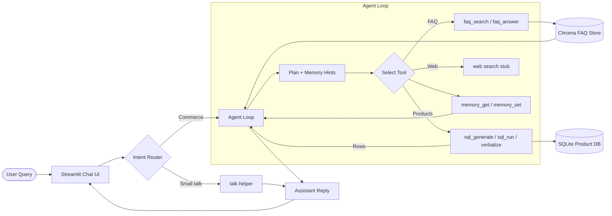

# E-commerce Chatbot (Agentic Runtime)

An agentic assistant for e-commerce stores. The bot understands customer questions, answers store policies from an FAQ knowledge base, and performs live product lookups against an SQLite catalog using a plan → act → observe → reflect loop. It ships with a Streamlit chat UI for demos and can be embedded behind the FastAPI service in `services/api`.

---

## 1. What You Get
- **Agentic workflow** – The agent plans a short tool sequence, executes one tool per step, retries once on empty results, and gathers a trace so you can audit actions.
- **FAQ retrieval (RAG)** – Top-k answers are fetched from a Chroma collection created from `app/resources/faq_data.csv`.
- **Product discovery** – Natural-language requests are translated into guarded SQL `SELECT` queries, executed against SQLite, and verbalized into a product list.
- **Session memory** – Preferred brands and price ceilings are remembered per conversation (Streamlit session or Redis via the API service).
- **Guardrails** – SQL is read-only with `LIMIT 50`, FAQ answers stay within context, Groq calls have timeouts/retries, and rate limiting is available in the API.



```mermaid
flowchart LR
    user([User Query]) --> ui[Streamlit Chat UI]
    ui --> router{Intent Router}
    router -->|Small talk| smalltalk[talk helper]
    router -->|Commerce| agent[Agent Loop]

    subgraph Agent Loop
        agent --> plan[Plan + Memory Hints]
        plan --> act{Select Tool}
        act -->|FAQ| faq_tools[faq_search / faq_answer]
        act -->|Products| sql_tools[sql_generate / sql_run / verbalize]
        act -->|Web| web_tool[web search stub]
        act --> memory_tools[memory_get / memory_set]
    end

    faq_tools --> chroma[(Chroma FAQ Store)]
    sql_tools --> db[(SQLite Product DB)]
    sql_tools -->|Rows| agent
    memory_tools --> agent
    agent --> response[Assistant Reply]
    smalltalk --> response
    chroma --> agent

    response --> ui
```

---

## 2. Quick Start (Local Demo)

```bash
git clone <your fork or repo url>
cd E-commerce_Chatbot
python -m venv .venv
.venv\Scripts\activate        # on macOS/Linux: source .venv/bin/activate
pip install -r requirements.txt
```

### Configure environment variables

You can set variables in a shell or a `.env` file (loaded automatically):

```text
GROQ_API_KEY=<your groq key>        # required for LLM calls
GROQ_MODEL=llama-3.3-70b-versatile  # or another Groq chat model
DB_PATH=app/db.sqlite               # optional override for the SQLite file
CHROMA_PATH=.chroma                 # optional: persistent FAQ embeddings
```

### Seed the product catalog

```bash
python scripts/init_db.py
```

This script creates the `product` table (if needed), wipes existing rows, and loads the seed data from `app/resources/ecommerce_data_final.csv`. It respects `DB_PATH`, so you can run:

```bash
python scripts/init_db.py --db-path ./data/catalog.db
```

### Run the Streamlit UI

```bash
python -m streamlit run app/main.py
```

Open the provided URL (default http://localhost:8501) and start chatting.

---

## 3. Optional FastAPI Service

For production scenarios use the API service (includes rate limiting, Prometheus metrics, tracing hooks, and Redis-backed memory):

```bash
python -m uvicorn services.api.server:app --reload
```

Endpoints:
- `POST /v1/ask` `{ "query": "..." }`
- `GET /healthz`, `GET /readyz`, `GET /metrics`

Set `API_BASE_URL` when running Streamlit to proxy queries through the service instead of in-process tools.

---

## 4. Sample Queries

Once the app is running, try these to validate behaviour:

- **Product lookup:** `Show Puma running shoes under 3000 sorted by rating.`  
  Expect a bullet list with title, price, discount percent, rating, and product link.

- **Policy / FAQ:** `What is your return policy?`  
  Uses Chroma FAQ data and replies with the matching policy text.

- **Small talk:** `Hi there, who are you?`  
  Streamlit small-talk helper responds without touching the catalog.

If you ask for a brand or price the agent cannot satisfy, it will request clarifications (e.g., “Could you share the preferred brand and budget ceiling you're looking for?”).

---

## 5. Troubleshooting

| Symptom | Fix |
| --- | --- |
| `Sorry, something went wrong: no such table: product` | Run `python scripts/init_db.py` (and confirm `DB_PATH` points to the database you seeded). |
| `An instance of Chroma already exists for ephemeral with different settings` | Configure `CHROMA_PATH` so every process uses the same persistent directory, or clear `~/.cache/chroma`. Latest code defaults to a single cached client per process. |
| API returns `429` | Rate limit hit. Increase `RATE_LIMIT_PER_MINUTE` or disable by unsetting it. |
| Responses show “I don't know.” | FAQ context did not match the query. Add the question/answer to `app/resources/faq_data.csv` and rerun the app (ingestion is idempotent). |

---

## 6. Testing and Validation

```bash
pytest
```

Highlights:
- `tests/test_agent.py` – covers FAQ success, SQL success, refinement behaviour, guardrails, trace bookkeeping, and memory capture.
- `tests/test_sql.py` – validates SQL extraction, whitelist enforcement, and chain orchestration.
- API smoke tests live in `tests/test_api_smoke.py` (ensures `/v1/ask` and health endpoints respond).

The test suite uses dummy Groq clients, so no network requests are made.

---

## 7. Project Layout

```
app/
  agent.py              # agent loop
  main.py               # Streamlit entry point
  sql.py / faq.py       # product + FAQ toolchains
  resources/            # FAQ CSV, seed data, images
  tools/                # individual tool wrappers
scripts/
  init_db.py            # create/seed SQLite product table
services/api/           # FastAPI production service
tests/                  # pytest suite
```

Run `scripts/init_db.py` whenever you refresh product data. The Chroma FAQ store is (re)ingested automatically on startup.

---

## 8. License

Apache License 2.0 (see `LICENSE`).
